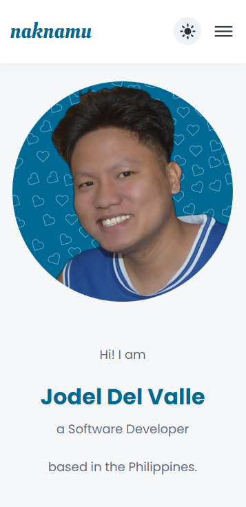
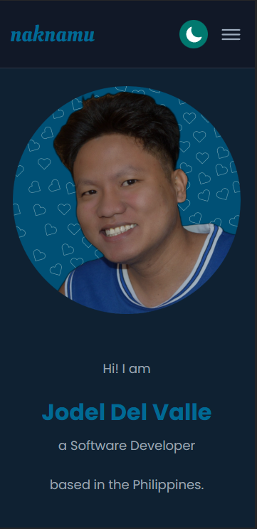
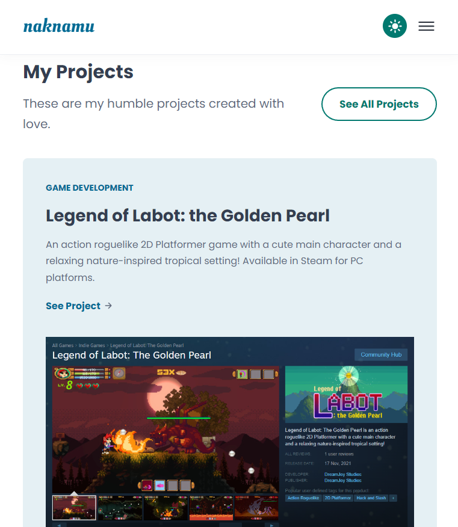
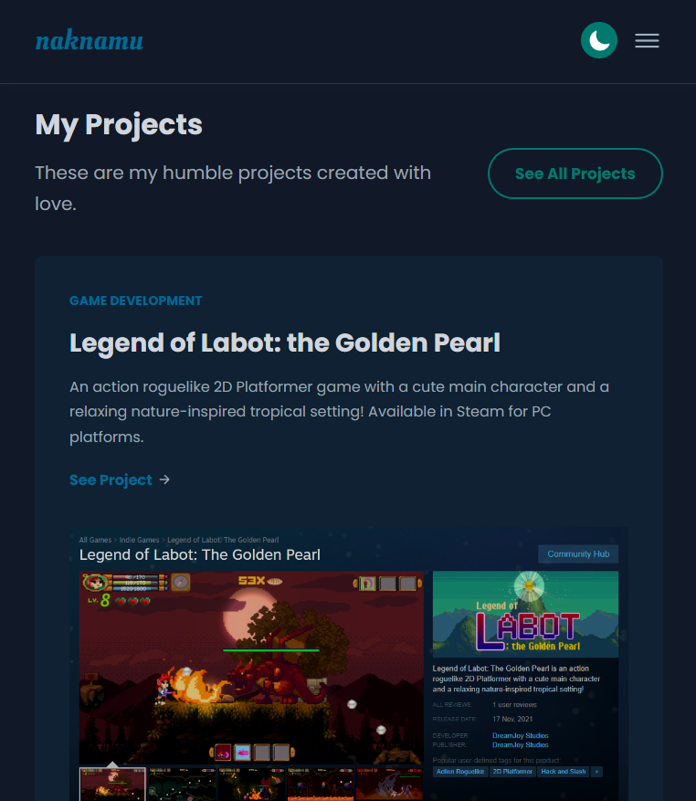
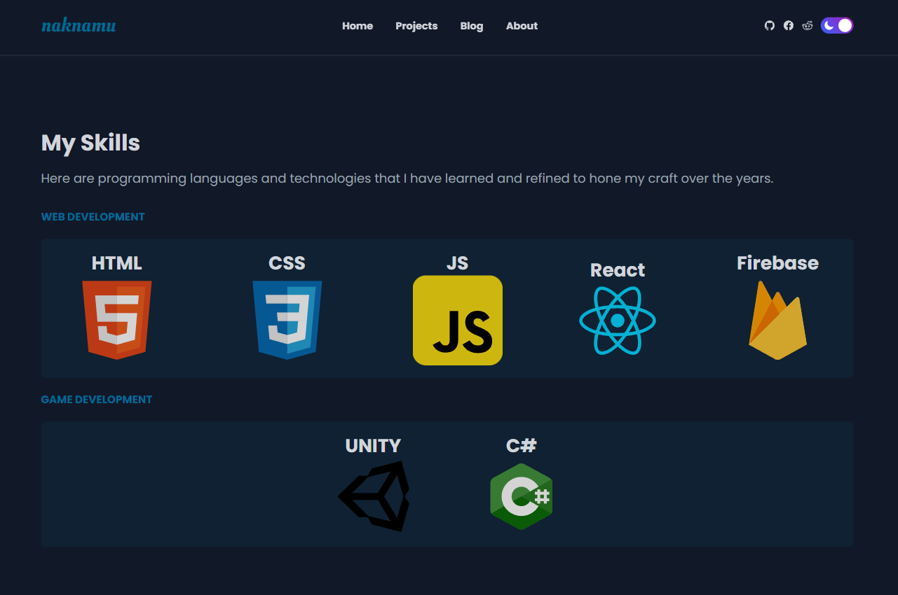
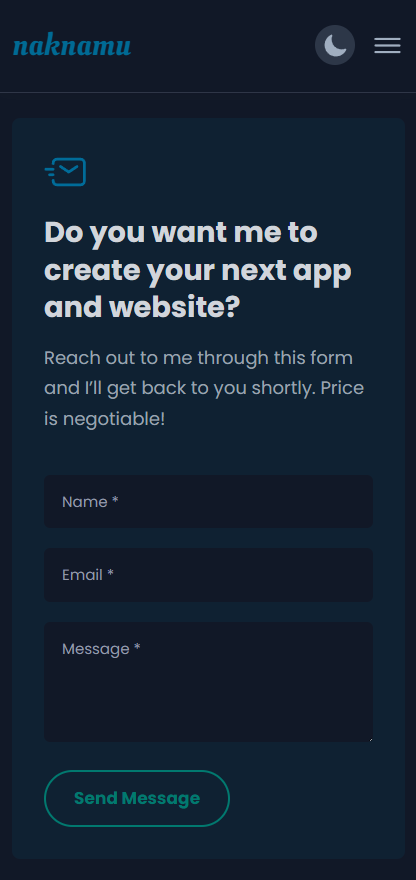

# My Humble Personal Porfolio

This is my personal portfolio created in HTML, CSS and vanilla JS. 

I showcased here the projects that I have developed over the years and 
the skills that I have attained and polished. 

## Live Demo 

Check the live demo in [www.naknamu.com](https://www.naknamu.com/)

## Features
- light and dark mode
- responsive for mobile, tablet and desktop
- clean and simple UI design
- scroll reveal effect

## Screenshots

### Mobile (Homepage)

  

### Tablet (Projects)

### Desktop (Skills)

### Mobile (Contact)

